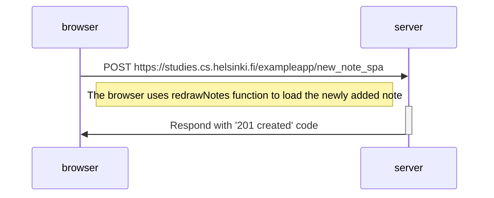

```mermaid
sequenceDiagram
    participant browser
    participant server

    browser->> server: POST https://studies.cs.helsinki.fi/exampleapp/new_note_spa
    Note right of browser: The browser uses redrawNotes function to load the newly added note
    activate server
    server->> browser: Respond with '201 created' code
    deactivate server
```